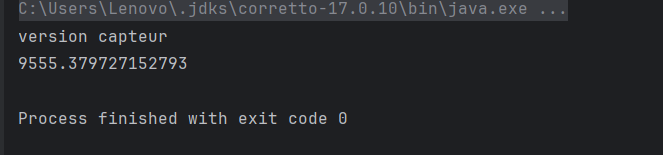
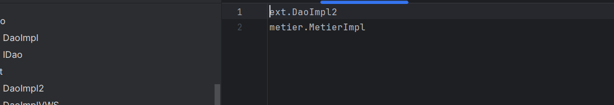
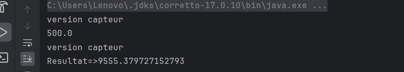
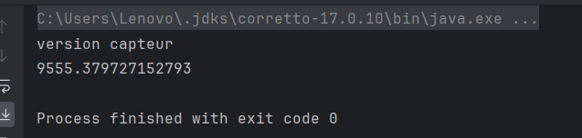
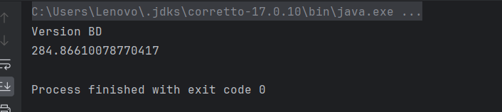

-<h3>Compte rendu<h3>
<h4>1-Creation de l'interface IDAO</h4>

<h4>2-Implementation de l'interface IDAO</h4>

<h4>3-Interface IMetier</h4>

<h4>4-Implementation avec couplage faible</h4>

<h4>5-Injection des dependances</h4>
<h5>----Statique----</h5>

*Deuxieme implementation de l'interface IDAO*

*Instanciation statique*

*Excecution*

<h5>----Dynamique----</h5>

*Config.txt*

*Instanciation Dynamique*

*Execution*

<h5>----Spring Framework----</h5>
<h6>Injection de dependances Version XML</h6>

*Application Context*

*Injection de dependances*

*Execution*

<h6>Injection de dependances Version Annotation</h6>

*Utilisation d'annotations sur l'implementation de l'interface Metier*

*Utilisation d'annotations sur l'implementation de l'interface DAO*

*Injection de dependances*

*Execution*

